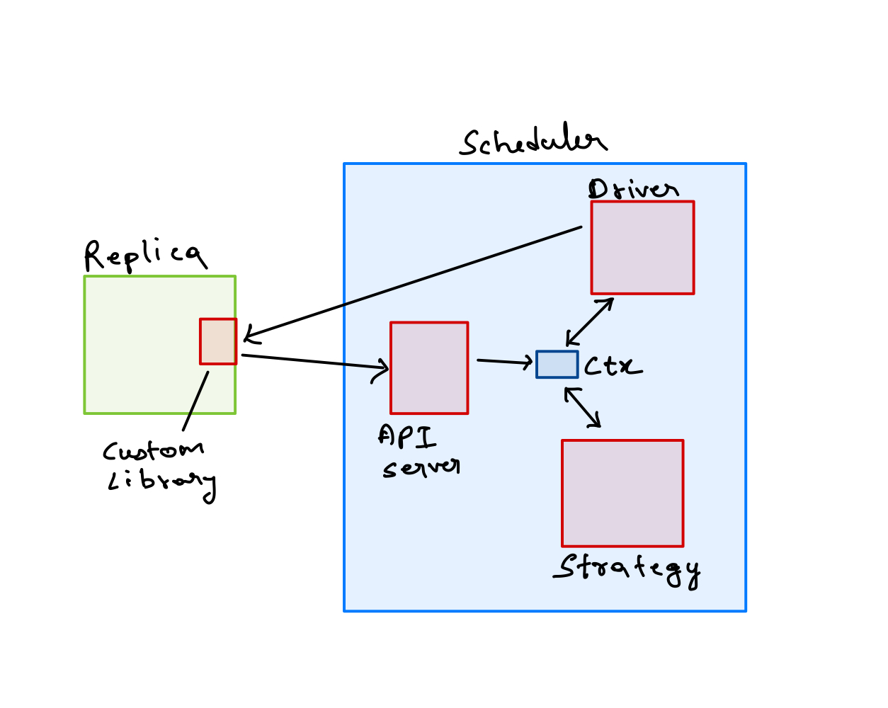

# Architecture
Instrumenting an implementation of an algorithm would require the implementation to send messages through the scheduler. Common libraries are provided that adapt to the API interface of the scheduler but using the library is not mandatory. Messages intercepted are held at the scheduler until they are allowed to be delivered.

[Timeouts](./timeouts.md) can also be used to test the system and requires further instrumentation.

In order to start receiving messages, we need to inject an initial workload to the distributed system and then being capturing messages. In randomized testing strategies, we will have to repeat this process (called a run), after resetting at the end of every run.



## Workflow

1. Messages arrive at the [APIServer](##api-server) which publishes `InterceptedMessage` event on the context.
2. [Driver](##driver) having subscribed to `InterceptedMessage` event parses the message, decides whether to intercept or not and then publishes `ScheduledMessage` event
3. [Strategy engine](##strategy) adds the message to the pool and publishes `EnabledMessage` event when it decides to allow it to be delivered.
4. Driver (listening for `EnabledMessage`) dispatches the message to the intended replica

## Driver

Driver is used to fit the working of the scheduler to the needs of the current algorithm being tested.

Driver's responsibility is to convey the status of the replicas to the scheduler, inject workload and clean up at the end of every run. It is also responsible for talking to the individual replicas of the distributed system being tested and to decide which messages should be intercepted. Function call order
- `Start` of the driver is called once when the scheduler is starting up. Driver can start the replicas here
- `Ready` is then called before the scheduler starts going through the runs. `Ready` should return true if all the replicas are up and running
- `StartRun` is called at the beginning of every run. The driver is supposed to inject workload to the replicas here. The return object is `RunObj` which contains a channel which can be used to indicate that a run is over.
- `StopRun` is called when either a timeout occurs for the given run or the driver indicated that the run is over through the `RunObj`. The driver can cleanup the replicas and communicate to them to reset for the next run.
- `Stop` is called at the end and the driver can teardown the replicas here.

### Common driver
This is a general purpose driver which can be used if the instrumentation uses one of the [client libraries](./client.md). The [workflow](##workflow) is defined assuming the common driver is being used. `WorkloadInjector` interface is used to inject the workload to the replicas which can be adapted to the needs of the specific implementation being tested.

## Context
Context objects contains all the meta information needed by all the components and also acts as a event bus. Ensure that Driver, Strategy is initialized with the context object and does subscribe to the necessary events.

## Strategy
Strategy is the heart of the scheduler, it plays around with the message orderings in order to put the distributed system under stress.

- `Start` is called at the beginning when the scheduler is initializing.
- `Reset` is called at the end of every run where the strategy can record the information/path explored in the previous run or choose to discard it.
- `Stop` is called at the end and can be used to close all the channels and gracefully exit

### Common Strategies
- [`NopScheduler`](../strategies/nop/main.go) does nothing, allows all incoming messages to pass through in the same order and can be used to do a sanity check on the instrumentation before beginning to run other strategies.

## API Server
API server exposes an HTTP interface for the replicas to send messages through the scheduler. Replicas can also post updates to their internal states and log messages of the actions which were taken. These can be later utilized in assessing the effectiveness of the testing strategy and to catch bugs if any.

### Endpoints
All endpoints accept `POST` requests with `application/json` body

Endpoint | Model | Description
-------- | ----- | -----------
`/messages` | [`Message`](####message) | To send messages intended to another replica
`/timeout` | [`Timeout](####timeouts) | To send timeouts that can also mode manipulated while testing. [Read here](./timeouts.md)
`/replica` | [`Replica`](####replica) | Each replica should update its information here when it starts up which can be used to communicate back to the replica, read its ready state, use private key information etc
`/state` | [`State`](####state) | Can be used to post updates to internal states of the replica
`/log` | [`Log`](####log) | Can be used to post log messages of the replicas. For example a log message indicating a value has been committed for a particular consensus instance


### Models

#### Common
```
ReplicaID: string
```

#### Message
```
Message {
    type: string
    from: ReplicaID
    to: ReplicaID
    msg: bytearray
    intercept: boolean
}
```
#### Timeouts
```
Timeout {
    type: string
    duration: int (milliseconds)
    replica: ReplicaID
}
```
#### Replica
```
Replica {
    id: ReplicaID
    addr: string (URI to communicate back on)
    info: map[string]any (Information related to replica. Eg: priv keys)
    ready: boolean (Indicate if replica is ready to receive workload)
}
```
#### State
```
State {
    id: ReplicaID
    state: string (serialized state information)
}
```
#### Log
```
Log {
    id: ReplicaID
    params: map[string]any (Log parameters. msg can be a special key)
}
```